# Siren
SIREN: A Scalable Isotropic Recursive Column Multimodal Neural
Architecture with Device State Recognition Use-Case

## Table of Contents

- [Siren](#siren)
  - [Table of Contents](#table-of-contents)
  - [Introduction](#introduction)
    - [Overview](#overview)
  - [Installation](#installation)
  - [Usage](#usage)
  - [SIREN Colab Demo](#siren-colab-demo)
  - [Data](#data)
    - [Data collection](#data-collection)
    - [Overview](#overview-1)
    - [Data structure](#data-structure)
  - [Results](#results)
    - [Classification](#classification)
    - [Regression](#regression)
  - [Interpretability](#interpretability)
    - [Visualizations of the total weights of the patch embedding layers in a Siren](#visualizations-of-the-total-weights-of-the-patch-embedding-layers-in-a-siren)
    - [Visualization of the gradients](#visualization-of-the-gradients)
  - [Contributing](#contributing)

## Introduction

Effective monitoring of device conditions and potential damage is a critical task in various industries, including manufacturing, healthcare, and transportation. The collection of data from multiple sources poses a challenge in achieving accurate device state recognition due to its complexity and variability. To address this challenge, we propose the use of multimodal data fusion through the combination of modalities, utilizing the concentration phenomenon, to establish appropriate decision boundaries between device state regions. We introduce **Siren**, a novel supervised multimodal, isotropic neural architecture with patch embedding, which effectively describes device states.

### Overview

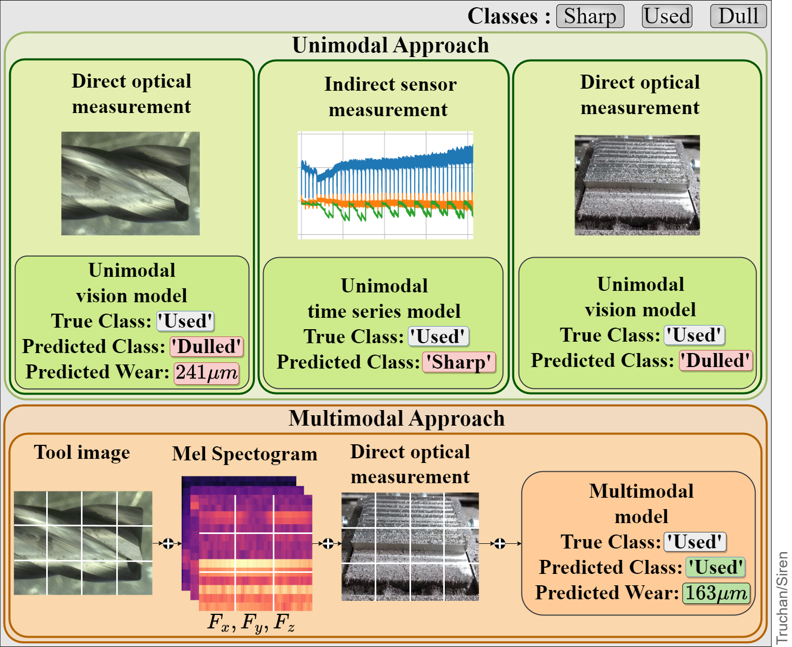

*Figure: A sample instance from Pentostreda that shows the importance of leveraging multimodal data for device state prediction.*


The **Siren** uses the linearly embedded patches of the grouped signals,
applies the isotropic architecture for representation retrieval, and uses TempMixer recurrent structure to map their temporal dependencies

In section [Data](#data) section we present the **Pentostreda** : the publicly available and accessible multimodal device state recognition dataset as a new benchmark for multimodal industrial device state recognition.


<p align="center">
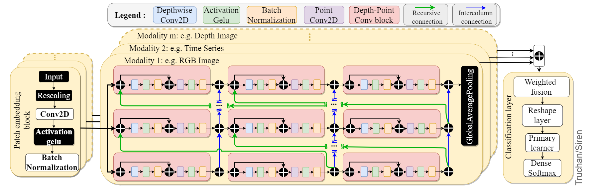
</p>


## Installation

Note that this work requires Python version 3.9 or later.

Install the dependencies from the requirements.txt with:
```
pip install -r requirements.txt
```
If you want to run the model on your GPU make sure to follow the [installation instructions from Tensorflow](https://www.tensorflow.org/install).

To run .ipynb files you have to install Jupyter Notebook/JupyterLab.

In order to clone the repository to your local machine use this command
 ```bash
git clone https://github.com/hubtru/Siren.git
```

## Usage

To use this project, follow these steps:
1. Download the project files to your local machine.
2. Choose the script that you want to use.
 - One or multiple unimodal classification models:
    - [siren_base_tool.ipynb](jupyter_notebooks/classification/siren_base_tool.ipynb), train and save unimodal network for tool images.
    - [siren_base_spec.ipynb](jupyter_notebooks/classification/siren_base_spec.ipynb), train and save unimodal network for spectrogram images.
    - [siren_base_chip.ipynb](jupyter_notebooks/classification/siren_base_chip.ipynb), train and save unimodal network for chip images.
  - One or multiple multimodal classification models (requires saved unimodal .h5 models):
    - [siren_base_multi_ts.ipynb](jupyter_notebooks/classification/siren_base_multi_ts.ipynb), train and save multimodal network for tool and spectrogram images.
    - [siren_base_multi_sc.ipynb](jupyter_notebooks/classification/siren_base_multi_sc.ipynb), train and save multimodal network for spectrogram and chip images.
    - [siren_base_multi_tc.ipynb](jupyter_notebooks/classification/siren_base_multi_tc.ipynb), train and save multimodal network for tool and chip images.
    - [siren_base_multi_tsc.ipynb](jupyter_notebooks/classification/siren_base_multi_tsc.ipynb), train and save multimodal network for tool, spectrogram and chip images.
  ___
  - One or multiple unimodal regression models:
    - [siren_reg_base_tool.ipynb](jupyter_notebooks/regression/siren_reg_base_tool.ipynb), train and save unimodal network for tool images.
    - [siren_reg_base_spec.ipynb](jupyter_notebooks/regression/siren_reg_base_spec.ipynb), train and save unimodal network for spectrogram images.
    - [siren_reg_base_chip.ipynb](jupyter_notebooks/regression/siren_reg_base_chip.ipynb), train and save unimodal network for chip images.
  - One or multiple multimodal regression models (requires saved .h5 unimodal regression models):
    - [siren_reg_base_multi_ts.ipynb](jupyter_notebooks/regression/siren_reg_base_multi_ts.ipynb), train and save multimodal network for tool and spectrogram images.
    - [siren_reg_base_multi_sc.ipynb](jupyter_notebooks/regression/siren_reg_base_multi_sc.ipynb), train and save multimodal network for spectrogram and chip images.
    - [siren_reg_base_multi_tc.ipynb](jupyter_notebooks/regression/siren_reg_base_multi_tc.ipynb), train and save multimodal network for tool and chip images.
    - [siren_reg_base_multi_tsc.ipynb](jupyter_notebooks/regression/siren_reg_base_multi_tsc.ipynb), train and save multimodal network for tool, spectrogram and chip images.
3. Update the paths section in each notebook if you want they differ from the recommended setup.
4. Change the variables section if desired.
5. Run the script

Those Notebooks will run fine with the structure of the git repository.
If you want to change dataset paths check the [Data Structures](#data-structure) section.

## SIREN Colab Demo
The following table showcases the SIREN algorithm demonstrations for both unimodal and multimodal tasks, including their respective modalities, signals, tasks, and descriptions along with links to Colab notebooks.


| Task           | Type         | Notebook Link                                                                                                                           | Modalities                                      |
|----------------|--------------|-----------------------------------------------------------------------------------------------------------------------------------------|-------------------------------------------------|
| Classification | Unimodal     | [](https://colab.research.google.com/github/hubtru/Siren/blob/main/jupyter_notebooks/classification/siren_base_tool.ipynb)                  | Tool images                                     |
| Classification | Unimodal     | [](https://colab.research.google.com/github/hubtru/Siren/blob/main/jupyter_notebooks/classification/siren_base_spec.ipynb)                  | Spectrogram images (Fx, Fy, Fz)                |
| Classification | Unimodal     | [](https://colab.research.google.com/github/hubtru/Siren/blob/main/jupyter_notebooks/classification/siren_base_chip.ipynb)                  | Chip images                                     |
| Classification | Multimodal   | [](https://colab.research.google.com/github/hubtru/Siren/blob/main/jupyter_notebooks/classification/siren_base_multi_ts.ipynb)         | Tool images, Spectrogram images (Fx, Fy, Fz)    |
| Classification | Multimodal   | [](https://colab.research.google.com/github/hubtru/Siren/blob/main/jupyter_notebooks/classification/siren_base_multi_sc.ipynb)         | Spectrogram images (Fx, Fy, Fz), Chip images    |
| Classification | Multimodal   | [](https://colab.research.google.com/github/hubtru/Siren/blob/main/jupyter_notebooks/classification/siren_base_multi_tc.ipynb)         | Tool images, Chip images                        |
| Classification | Multimodal   | [](https://colab.research.google.com/github/hubtru/Siren/blob/main/jupyter_notebooks/classification/siren_base_multi_tsc.ipynb)       | Tool images, Spectrogram images (Fx, Fy, Fz), Chip images |
| Regression     | Unimodal     | [](https://colab.research.google.com/github/hubtru/Siren/blob/main/jupyter_notebooks/regression/siren_reg_base_tool.ipynb)              | Tool images                                     |
| Regression     | Unimodal     | [](https://colab.research.google.com/github/hubtru/Siren/blob/main/jupyter_notebooks/regression/siren_reg_base_spec.ipynb)              | Spectrogram images (Fx, Fy, Fz)                |
| Regression     | Unimodal     | [](https://colab.research.google.com/github/hubtru/Siren/blob/main/jupyter_notebooks/regression/siren_reg_base_chip.ipynb)              | Chip images                                     |
| Regression     | Multimodal   | [](https://colab.research.google.com/github/hubtru/Siren/blob/main/jupyter_notebooks/regression/siren_reg_base_multi_ts.ipynb)     | Tool images, Spectrogram images (Fx, Fy, Fz)    |
| Regression     | Multimodal   | [](https://colab.research.google.com/github/hubtru/Siren/blob/main/jupyter_notebooks/regression/siren_reg_base_multi_sc.ipynb)     | Spectrogram images (Fx, Fy, Fz), Chip images    |
| Regression     | Multimodal   | [](https://colab.research.google.com/github/hubtru/Siren/blob/main/jupyter_notebooks/regression/siren_reg_base_multi_tc.ipynb)     | Tool images, Chip images                        |
| Regression     | Multimodal   | [](https://colab.research.google.com/github/hubtru/Siren/blob/main/jupyter_notebooks/regression/siren_reg_base_multi_tsc.ipynb)   | Tool images, Spectrogram images (Fx, Fy, Fz), Chip images |


## Data
**Pentostreda**: Pento-modal Device State Recognition Dataset

- Data preview (~20 samples) is available in ./dataset
- Complete Pentostreda dataset (918MB) is available:  [Pentostreda]([URL]()) (available soon)
- Complete Pentostreda.zip file (918MB) is available:  [Pentostreda.zip]([URL]()) (available soon)

<p align="center">
  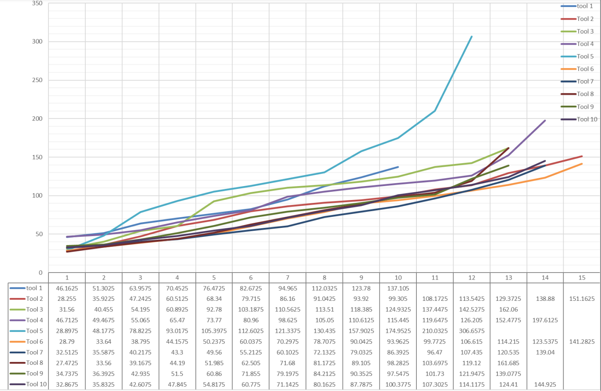
</p>


*Figure: The flank tool wear measured with Keyence
VHX- S15F profile measurement unit microscope for all
ten tools. The values are presented in μm.*


This section provides information about the data used in the project, including where it came from, how it was collected or generated, and any preprocessing or cleaning that was done.

### Data collection


<table>
<tr>
<td>
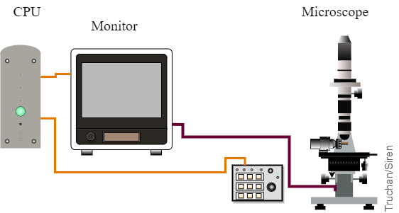
<br>
<em>Figure: Measuring stage with the digital microscope and the industrial computer.</em>
</td>
<td>
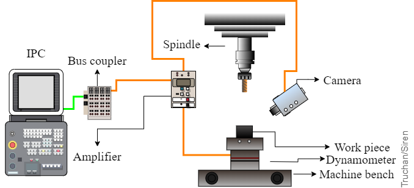
<br>
<em>Figure: Processing stage with the signal recording diagram</em>
</td>
</tr>
</table>

*Figure The forces signals depicted on [Figure Signal](#fig:signal) present 30 milling phases. After each phase, a picture of the tool was taken with an industrial microscope to determine its exact wear. A strong correlation between the tool wear and the force amplitudes can be observed, with the smallest amplitudes for the sharp tool, increasing with tool wear.*

### Overview

The summary of the **Pentostreda** data-set with classes samples of Tool 1.

<p align="center">
  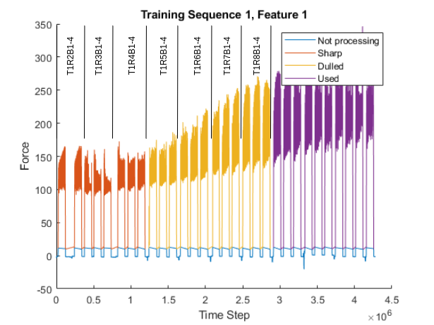
  <br>
  <i>Figure: The summary of the **Pentostreda** data-set with classes samples of Tool 1.
.</i>
</p>

For more visualisation, see:  [Forces-Visualisation](interpretability/forces_visualisation/)

### Data structure
The folder contains the pictures of the flank wear, pictures of metal workpeace chips and the spectrograms of the forces in 3 axes (Fx, Fy, Fz).
```css
dataset/
│
├── chip/
├── spec/x/
├── spec/y/
├── spec/z/
├── tool
│
├── labels.csv
├── labels_reg.csv
├── labels_sample.csv
└── labels_reg_sample.csv
```
## Results

### Classification
This section provides a summary of the results of the project, including any performance metrics or visualizations that were produced. It should also include a discussion of the results and their implications.


| Class  | Precision | Recall | F1-score |
| ------ | --------- | ------ | -------- |
| Sharp  | 1.00      | 1.00   | 1.00     |
| Used   | 1.00      | 0.95   | 0.97     |
| Dulled | 0.92      | 1.00   | 0.96     |


<p align="center">
  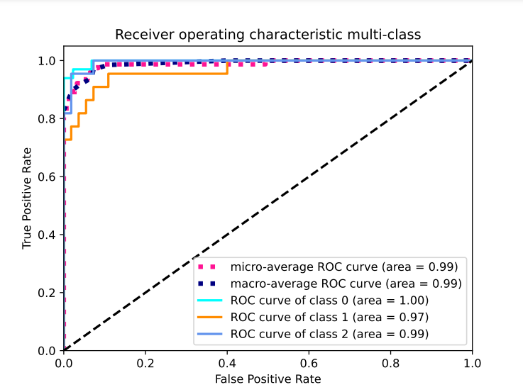
  <br>
  <i>Figure: Receiver operating multi-class characteristic for SIREN hyper-band optimised multimodal (TSC: Tool, Sectrogram, Chip) model.</i>
</p>


### Regression 

<p align="center">
  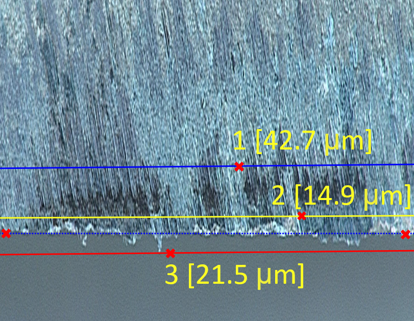
  <br>
  <i>Figure: Visualisation of the base (blue-dotted), tool wear (blue), overhang (red), gaps (yellow) labels used for the regression problem.</i>
</p>


<p align="center">
  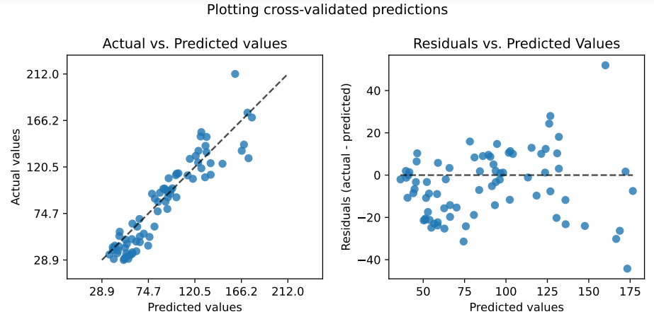
  <br>
  <i>Figure: Visualisation of the actual and the residual flank wear values predicted by Siren on the Pentostreda dataset.</i>
</p>

For more visualisation, see:  [interpretability/ped](interpretability/ped)

## Interpretability

### Visualizations of the total weights of the patch embedding layers in a Siren

The total weights of the patch embedding layers in a Siren with a patch of 16 are visualized. While these layers essentially act as crude edge detectors, the industrial nature of the Mudestreda dataset prevents any discernible patterns from emerging. Interestingly, a number of filters bear a striking resemblance to noise, indicating the potential requirement for increased regularization.

<p align="center">
  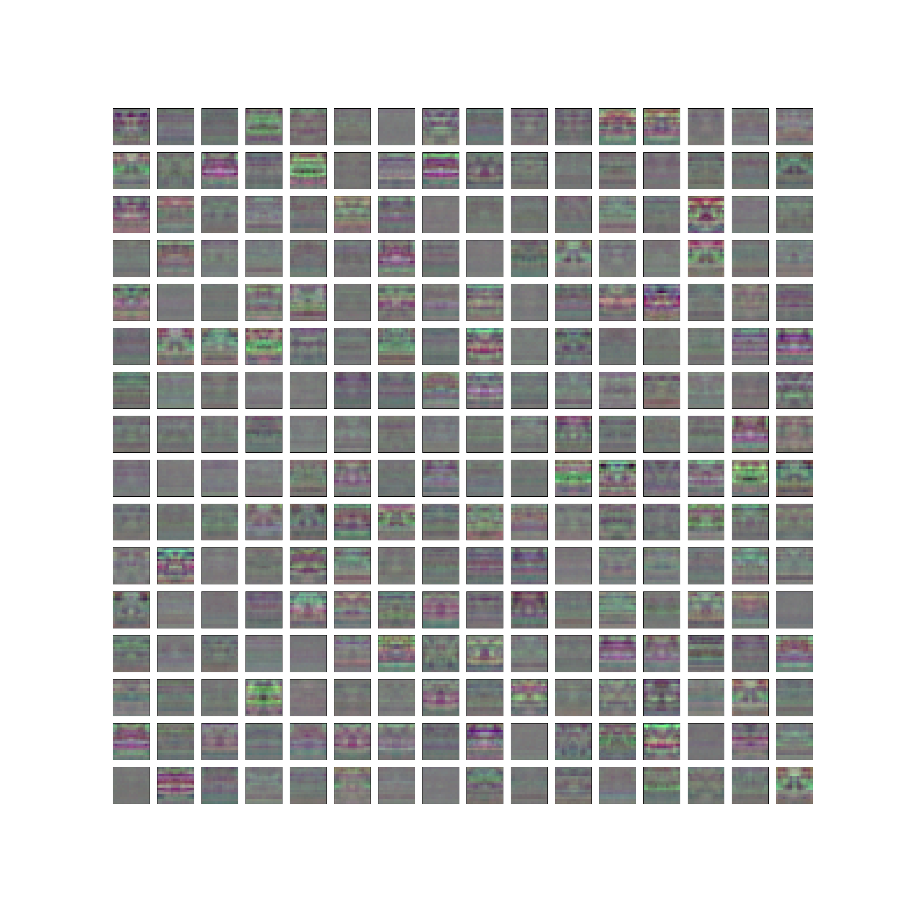
  <br>
  <i>Figure: The total weights of the patch embedding layers in a SIREN with a patch of 8 for spectrogram F_x.</i>
</p>

<p align="center">
  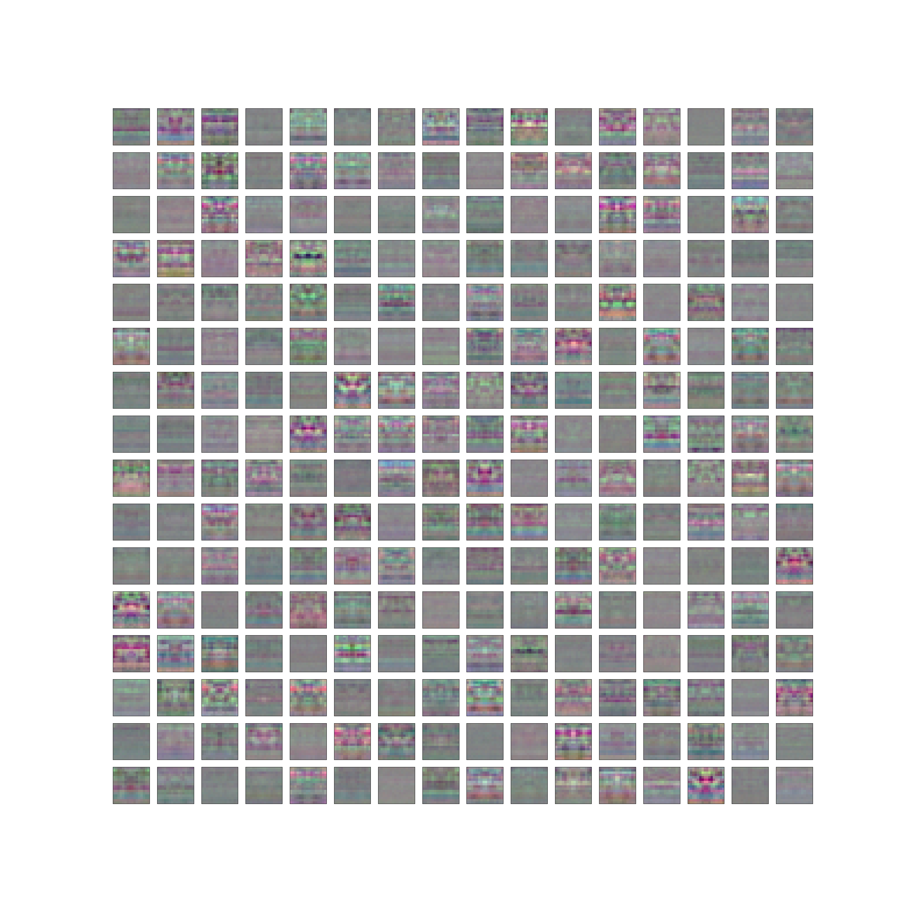
  <br>
  <i>Figure: The total weights of the patch embedding layers in a SIREN with a patch of 8 for spectrogram F_y.</i>
</p>

<p align="center">
  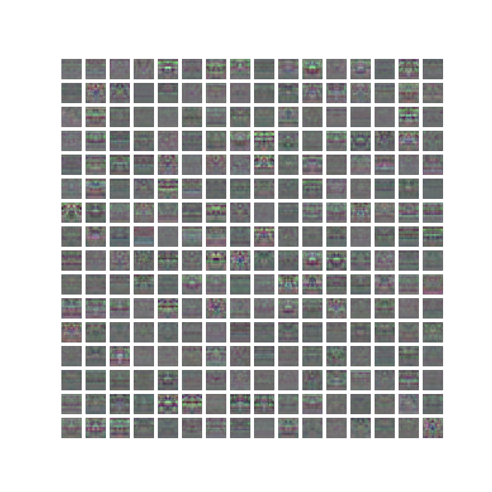
  <br>
  <i>Figure: The total weights of the patch embedding layers in a SIREN with a patch of 8 for spectrogram F_z.</i>
</p>

<p align="center">
  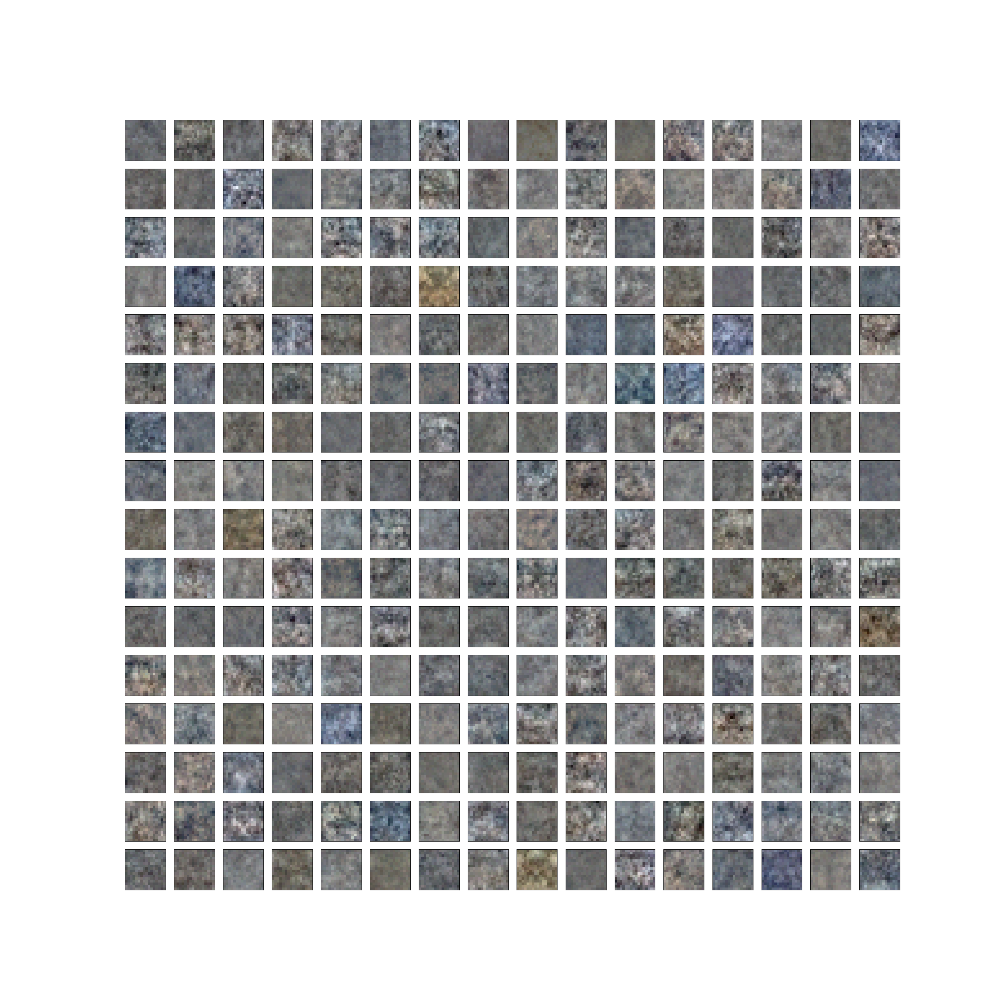
  <br>
  <i>Figure: The total weights of the patch embedding layers in a SIREN with a patch of 8 for chip images.</i>
</p>

<p align="center">
  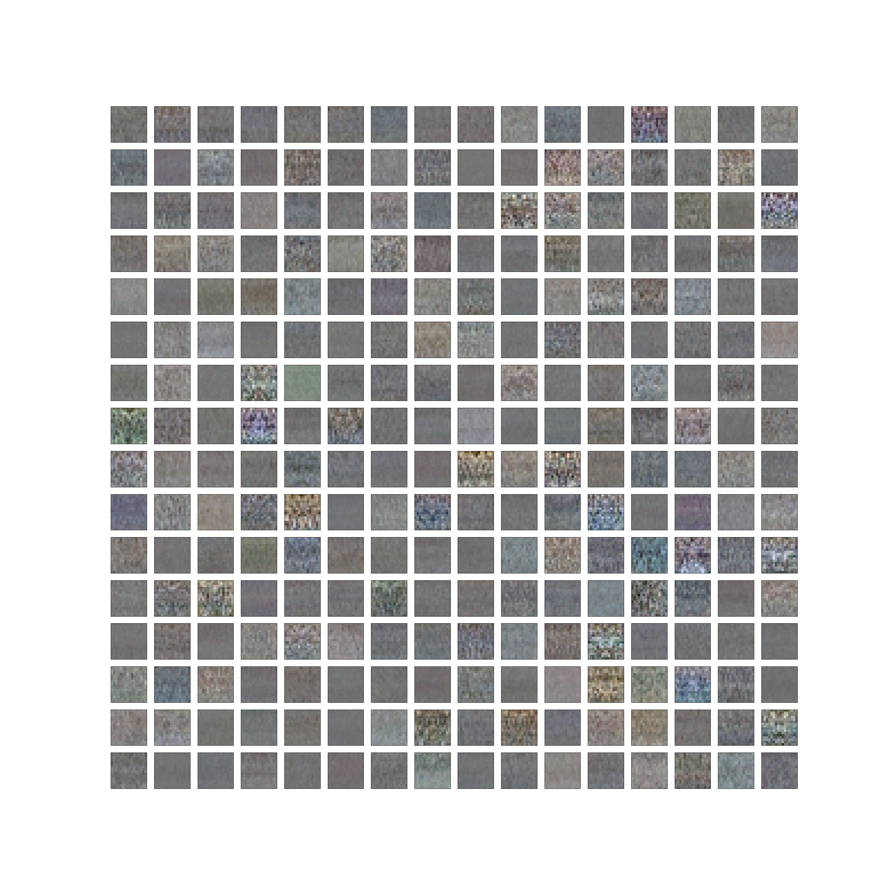
  <br>
  <i>Figure: The total weights of the patch embedding layers in a SIREN with a patch of 8 for tool images.</i>
</p>


<!-- ### Visualizations of the convolutional kernels


*Figure: The subset of depthwise convolutional kernels from last layer (layer 9) of the image pathaway Siren.*


*Figure: The subset of depthwise convolutional kernels from last layer (layer 9) of the timeseries pathaway Siren.* -->


### Visualization of the gradients

<p align="center">
  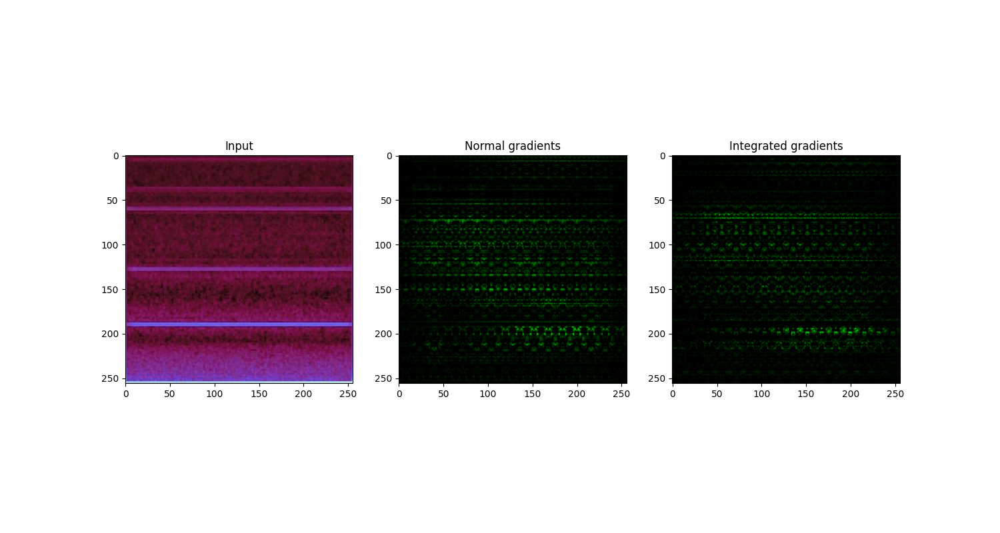
</p>

<p align="center">
  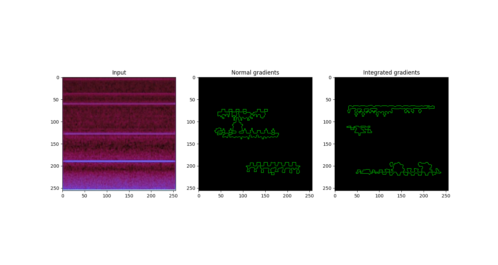
</p>


*Figure: Visual comparison of normal gradient and integrated gradient on a *used* tool blade image. The normal gradient and integrated gradient images offer pixel-wise and area-wise importance visualization, respectively.*

For more visualisation, see:  [interpretability](interpretability/)


## Contributing

This section provides instructions for contributing to the project, including how to report bugs, submit feature requests, or contribute code. It should also include information about the development process and any guidelines for contributing.

Pull requests are great. For major changes, please open an issue first to discuss what you would like to change.

Please make sure to update tests as appropriate.